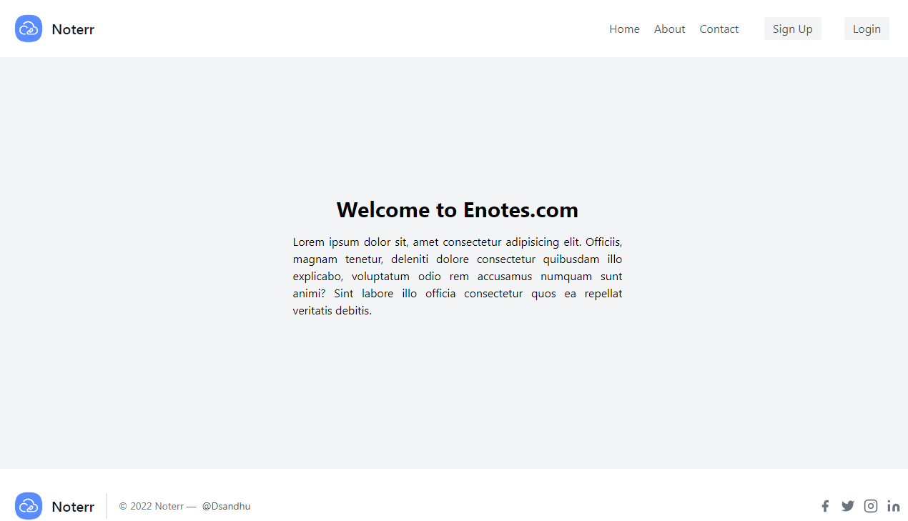
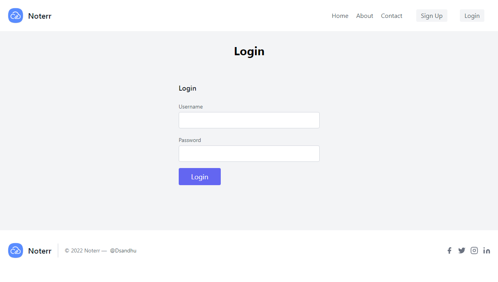
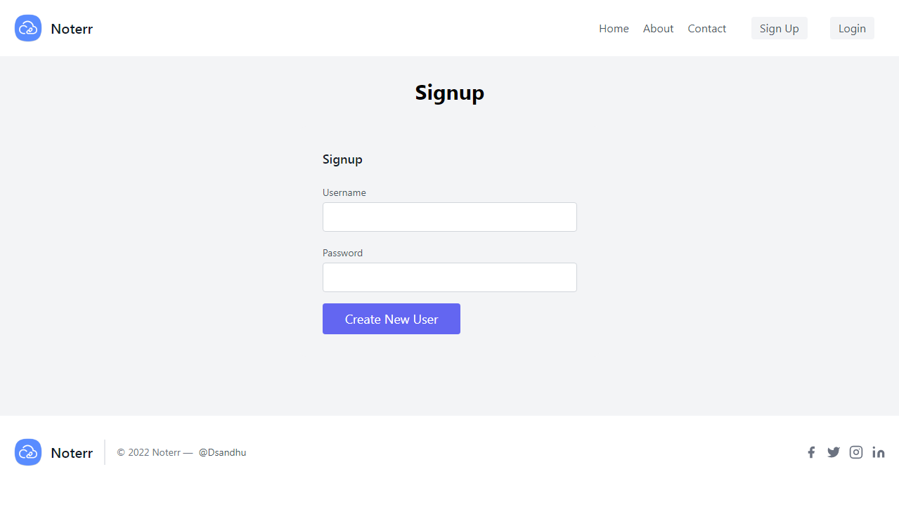
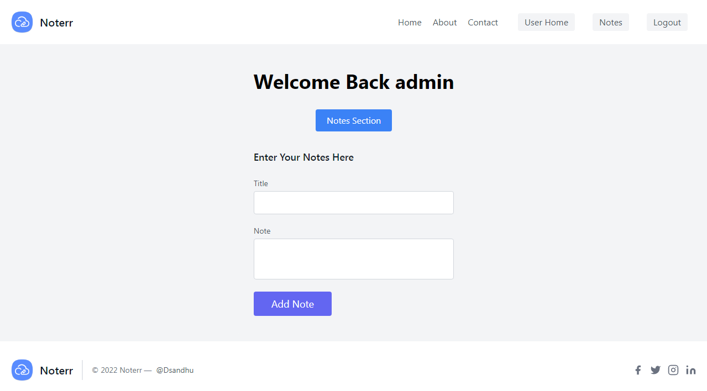
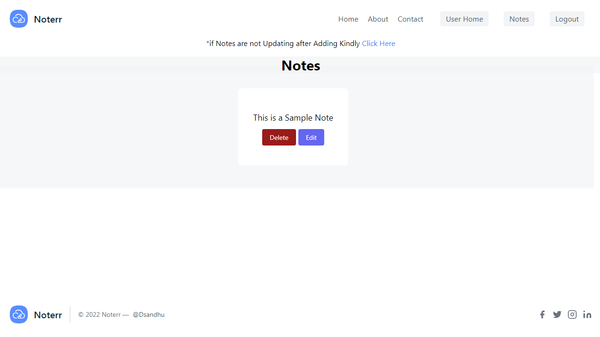
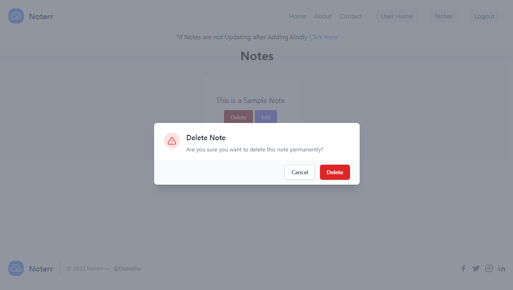

# Noterr 
 
Noterr is a Notes Taking App that Crate/Retrive/Update/Delete Notes after authenicate user by Login. This an Express App with Handlebars in Frontend with no Database (Creates Folder of Notes). 
## Tech Stack

**Client:** Express-handlebars, TailwindCSS

**Server:** Node, Express

## Run Locally

Clone the project

```bash
  git clone "https://github.com/DuvenderSandhu/Noterr/"
```

Go to the project directory

```bash
  cd Noterr
```

Install dependencies

```bash
  npm install express express-handlebars
```

Start the server

```bash
  node index
```

## Screenshots












## Feedback

If you have any feedback, please feel free to talk duvendersandhu@gmail.com
